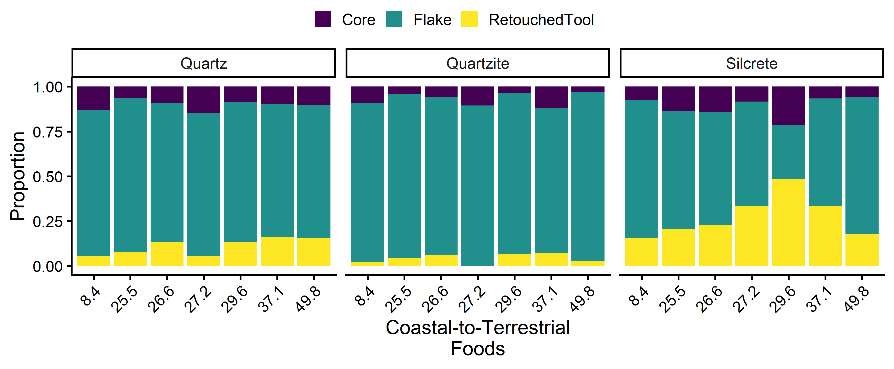
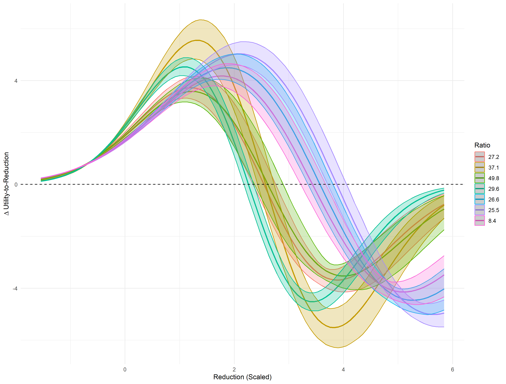
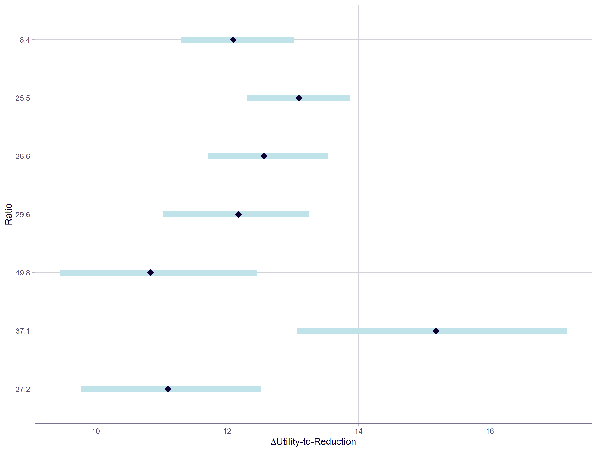
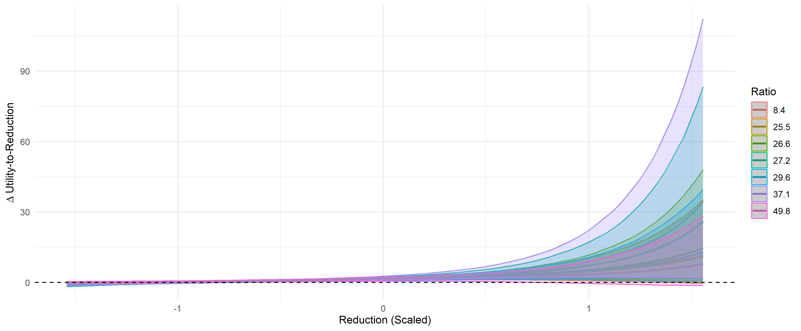
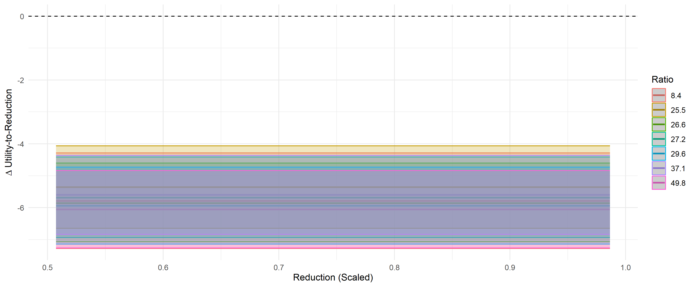

# The effects of coastal resource use on hunter-gatherer technological strategies 4 ka
This project aims to evaluate the effect that increasing coastal resource use had on hunter-gatherer technological and social strategies at Steenbokfontein Cave in South Africa 4,000 years ago (4 ka). For most of human history, people have aggregated around lakes, rivers, and coasts. Aquatic environments provide humans access to dense, predictable, and defensible resources such as fish and shellfish. Aquatic resource abundance has determined the permanence of these settlements. Seasonal aggregation would have allowed hunter-gatherers from far and wide to temporarily share knowledge, resources, technology, and build social relationships. Permanent aggregation around dense and reliable aquatic resources would have provided an opportunity to develop specialized technologies and practice coordinated resource sharing and distribution, which are key features that define “complex hunter-gatherers.” Therefore, aquatic resources plausibly served as a lynchpin in the development of key evolutionary traits in hunter-gatherers, most notably reduced mobility, surplus accumulation and sharing, and technological innovation; yet surprisingly few studies have directly evaluated how aquatic resources structured hunter-gatherer mobility patterns and technological strategies.

## Overview
This is a multivariate project that examines whether hunter-gatherer technological strategies changed when they increased shellfish consumption at Steenbokfontein Cave. I use Bayesian models to evaluate the relationship of several stone tool variables including utility, length, mass, and raw material. I use gt_summary and ggplot2 to develop publish-quality tables and figures.

I first describe the composition of hunter-gatherer toolkits, including the raw stone material, types, and frequencies of their stone technology. I describe these data in tabular and graphical representations. I then construct a Bayesian model with catgeorical and dirichlet families to evaluate whether there are significant trends in raw material and toolkit composition as hunter-gatheres focused on coastal resources.

I then evaluate three specific artifact classes most commonly found in archaeological contexts to evaluate whether there are technological shifts sensitive to increased coastal resource exploitation. Namely, I examine stone flakes, cores, and scrapers. I use attributes I recorded from the tools to evaluate shifts in tool utility, reduction, and retouch intensity. To do this, I modeled several Bayesian GLMs composed of simple, hierarchical, and second order polynomials. I then evaluate which model fit the data best using a leave-one-out analysis. I then visualize and compute the rate of change between tool utility, reduction, and retouch intensity for the three stone tool classes. 

## Hypothesis
I expect shifts in toolkits as hunter-gatherers increased coastal resource use. If my models show significant shifts in toolkit composition and rates of change between tool utility, reduction, and retouch intensity, then there is evidence to support this hypothesis.

## Results
There are mixed results in favor and against my initial hypothesis. Below, I highlight the most noteable patterns in hunter-gatherer technological strategies as they increased coastal resource use.

### Toolkit Composition
Though there are visible trends in toolkit and material composition (**FIgure 1**), a proportional model conducted with a catgorical and dirichlet family show no significant differences. This contradicts previous observations that predicted hunter-gatherer toolkits shift in response to changing mobility and dietary patterns.

### Flaked tools
There are clear trends in how hunter-gatherers managed their flaked tool utility and reduction intensity (**Figure 2**) as they increased coastal resource use. **Figure 2** and **Figure 3** show the slope estimate between flake utility and reduction intensity. There are clear shifts towards lower rates as hunter-gatherers focused on coastal resources. This result implies that hunter-gatherers focused on much slower shifts between flake utility and reduction intensity when focused on coastal resource use.

### Core tools
There are no visible trends in how hunter-gatherers managed their core tool utility to reduction intensity (**Figure 4**). This implies that core maintenance is not always sensitive to shifts in hunter-gatherer diets and mobility strategies.

### Scrapers
There are no visible trends in how hunter-gatherers managed scraper utility and retouch intensity as they increased coastal resource use(**Figure 5**). This suggests that we should expects shifts in every aspect of hunter-gatherer toolkits. Instead, a focus on coastal resources led to a shift in selective technologies.

## Conclusion
There are some stone tool trends that match our hypothesis, but the vast majority contradict our expectations. This conclusion implies that archaeologists need to think carefully about which stone tool patterns they expect to find as hunter-gatherers aggregate along coastal resources. There does not seem to be a one-fits-all pattern of hunter-gatherer technological adaptations. Instead, there are selective shifts in technology that are driven by a combination of social strategies and task-specific needs, exemplifying a broad spectrum of hunter-gatherer behaviors.

## Tools Used
- 'R'
- 'tidyverse', 'ggplot2', 'gt', 'brms'
- Quarto

## Folder Structure

- `data/`: contains input data for all R quarto documents
- `code/`: all analysis scripts required to re-run the project provided as quarto documents
- `results/`: figures, tables, and other output files produced inside and outside R

## Author

Alex Gregory

PhD Candidate | Quantitative Analyst | Data Scientist | Bayesian | Archaeologist

arg9496@nyu.edu
